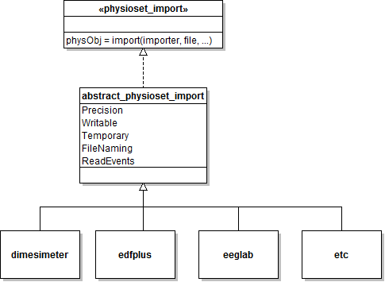

physioset data importers
================

The MATLAB package [physioset.import][physioset-import-pkg] contains data
importer classes. These classes can be used to generate 
[physioset][physioset] objects based on the values contained in disk files
of various formats. 

[physioset-import-pkg]: ./
[physioset]: ../@physioset/README.md

Data importer classes are organized in the following class hierarchy:



At the top of the hierarchy is the interface `physioset_import` which 
defines method `import()`, that must be implemented by all concrete 
classes lower in the hierarchy. Class 
[abstract_physioset_import][abs-phys-imp] defines a set of properties 
common across all data importers. At the bottom of the hierarchy are the 
concrete data importer classes that can be instantiated, and used to
generate [physioset][physioset] objects from various raw data formats.

[abs-phys-imp]: ./abstract_physioset_import.md


## Usage

All `physioset` data importers are used similarly. E.g. to import data from 
an `.mff` data file `myfile.mff`:

````matlab
myImporter = physioset.import.mff;
pObj = import(myImporter, 'myfile.mff');
````

where `pObj` is a `physioset` object built out of the contents of 
`myfile.mff`. Similarly, to import a file in `.edf` format `myfile.edf`:

````matlab
myImpoter = physioset.import.edfplus;
pObj = import(myImporter, 'myfile.edf');
````

Data importers with custom behaviours can be built by specifying custom 
values for various construction options. Some of these options (also 
referred to as _importer properties) are common to all data importers, i.e.
they are inherited from the abstract class 
[abstract_physioset_import][abs-phys-imp], while other are specific to 
a given data importer class. For instance, the `.mff` and `.edf` importers 
above could have been tuned so that the produced `physioset` stores data 
values in `single` precision (instead of the default `double`):

````matlab
myImporter = physioset.import.mff('Precision', 'single');
pObj = import(myImpoter, 'myfile.mff'); % pObj uses single precision
% The same for the edfplus importer
myImporter = physioset.import.edfplus('Precision', 'single');
pObj = import(myImpoter, 'myfile.edf'); % pObj uses single precision
````

### Using custom sensor information

Typically a physioset importer reads the sensor coordinates from the 
disk file that contains your M/EEG data. But sometimes you want to 
manually set the sensor information when importing a physioset. You 
can do that using option `Sensors`. For instance, the following code 
can be used to import EEG data acquired with EGI's 256-sensors net:

````
mySensors = sensors.eeg.from_template('egi256')
myImporter = physioset.import.matrix('Sensors', mySensors);
myData = import(myImporter, randn(257, 1000));
````


## Available data importers

A list of currently available data importers can be found below. However, 
this list might be outdated. In general, any class contained within the 
[physioset.import][physioset-import-pkg] package is a data importer class.
Thus, you can get the most up-to-date list of available importers by 
inspecting the [package contents][physioset-import-pkg].

Data Importer (class name)       | Data format 
--------------                   | -------------------- 
[@dimesimeter][dimesimeter-class]| Dimesimeter light measurements (`.txt`)
[@edfplus][edfplus-class]        | Time-series in [EDF+ format][edfplus] (`.edf`)
[@eeglab][eeglab-class]          | [EEGLAB][eeglab]'s `.set` files
[@fieldtrip][fieldtrip-class]    | [Fieldtrip][fieldtrip]'s data structure in `.mat` format
[@fileio][fileio-class]          | A wrapper to Fieldtrip's [fileio][fileio] module
[@geneactiv_bin][geneactiv-class]| [Geneactiv][geneactiv]'s `.bin` accelerometry data format
[@matrix][matrix-class]          | MATLAB matrix in MATLAB's workspace
[@mff][mff-class]                | [EGI][egi]'s `.mff` data format for high-density EEG
[@neuromag][neuromag-class]      | [Neuromag][neuromag]'s `.fif` format for MEG
[@physioset][physioset-class]    | [meegpipe][meegpipe]'s physiological dataset format `.pset`/`.pseth`

[dimesimeter-class]: ./@dimesimeter
[edfplus-class]: ./@edfplus
[edfplus]: http://www.edfplus.info/
[eeglab-class]: ./@eeglab
[eeglab]: http://sccn.ucsd.edu/eeglab/
[fieldtrip-class]: ./@fieldtrip
[fieldtrip]: http://fieldtrip.fcdonders.nl/ 
[fileio-class]: ./@fileio
[fileio]: http://fieldtrip.fcdonders.nl/development/fileio
[geneactiv-class]: ./@geneactiv_bin
[geneactiv]: http://www.geneactive.co.uk/
[matrix-class]: ./@matrix
[mff-class]: ./@mff
[egi]: http://www.egi.com/
[neuromag]: http://www.elekta.com/healthcare-professionals/products/elekta-neuroscience/functional-mapping.html
[neuromag-class]: ./@neuromag
[physioset-class]: ./@physioset
[meegpipe]: http://www.germangh.com/meegpipe/


